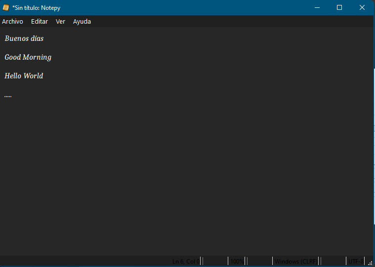

# Notepy
Notepy is a GUI program to write notes and text files. This program tries to imitate Window's Notepad functionalities. 

This software has been written by caicesardev with Python 3.9 using PySide6 as the GUI library.

